<YBIGTA 29기 팀프로젝트 1조>

 
# 🎬 YBIGTA 뉴비 팀 프로젝트 — 영화 리뷰 분석: 「토이 스토리 5 (2026)」

여러 리뷰 사이트에서 영화 **토이 스토리 5**의 리뷰를 수집(크롤링)하고, EDA·전처리·FE 를 거쳐
사이트 간 비교분석까지 수행하는 프로젝트입니다.

---

## 1. 팀 소개 · 팀원 자기소개  ✅

팀 소개 : 안녕하세요. YBIGTA 29기 팀프로젝트 1조입니다! 열심히 하겠습니다.

팀원 자기소개
민신원 : 안녕하세요! 저는 컴퓨터과학과 3학년에 재학중인 민신원입니다. 학회활동을 통해 진로 적성도 찾고 다양한 프로젝트를 팀원들과 함께해보는 경험을 쌓고 싶습니다. 취미로는 게임, 당구 등 노는걸 좋아합니다. 공부하기 싫지만 YBIGTA에서 열심히 활동해 많은 배움을 얻어가고 발전하고 싶습니다!

윤소현 : 안녕하세요, 저는 연세대학교 응용통계학과 3학년에 재학중인 윤소현입니다. 현재 연세대학교 Jinius 연구실에서  학부 연구생으로 활동하며 다양한 연구에 참여하며 배우고 있습니다. 또, YDMC라는 봉사 동아리에서 전공 알리미 활동을 하며 소소하지만 고등학교 아이들에게 학과에 대해 소개하는 활동도 하고 있습니다. Ybigta에서 많은 분들과 친해지고 더 많은 걸 알아가고 싶습니다!

최윤서: 안녕하세요, 저는 연세대학교에서 컴퓨터과학과와 계량위험관리전공을 공부하고 있습니다. 현재 고려대학교의 VGI 연구실에서 아바타 생성관련 연구를 진행하고 있습니다. 취미로는 동물 구경하는 것, 한강에서 자전거 타기, 옷 구경하는 것을 좋아합니다.

---

## 2. 분석 주제 & 데이터 소개

- **분석 대상 영화**: 토이 스토리 5 (Toy Story 5, 2026 · 픽사/디즈니 · 2026-06 국내 개봉)
- **분석 목표**: 사이트별 리뷰의 별점/텍스트/시계열 특성을 비교

| 사이트 | 담당 | 링크 | 데이터 형식 | 수집 | 전처리 후 |
|---|---|---|---|---|---|
| **왓챠피디아** | ✅ 최윤서 | [토이 스토리 5](https://pedia.watcha.com/ko-KR/contents/m5DPaAD/comments) | CSV (별점·작성일·관람일·내용·좋아요·답글·스포일러) | **595** | 576 |
| **IMDb** | ✅ 민신원 | [Toy Story 5 Reviews](https://www.imdb.com/title/tt29355505/reviews/) | CSV (별점·작성일·제목·본문·출처 URL) | **500** | 500 |
| **메가박스** | ✅ 윤소현 | [실관람평](https://www.megabox.co.kr/movie-detail/comment?rpstMovieNo=26033300) | CSV (평점·작성일·내용) | **550** | 542 |

**왓챠피디아 (`database/reviews_watcha.csv`)** — 최윤서
- 컬럼: `id, user, rating(0.5~5.0), created_at, watched_at, likes, replies, spoiler, text`
- 유효 수집 개수: **595개** (최소 조건 500개 충족), 모든 행에 별점·날짜·내용 포함
- 별점 척도: 왓챠 내부 0~10 정수 → 사용자 표기 **0.5~5.0** 로 변환 저장

**IMDb (`database/reviews_imdb.csv`)** — 민신원
- 컬럼: `site, target, rating(1~10), date, review_title, review, source_url`
- 수집 개수: **500개**, 리뷰 제목이 본문과 별도로 존재하는 것이 특징
- 수집 기간: 2026-06-17 ~ 2026-07-26

**메가박스 (`database/reviews_megabox.csv`)** — 윤소현
- 컬럼: `score(1~10), review, date`
- 수집 개수: **550개**. 예매·관람 이력이 있어야 작성 가능한 **실관람평**
- 수집 기간: 2026-07-14 ~ 2026-07-20 (최신순 페이지 기준 7일치)
- 작성일이 `2 분전`, `3 시간전` 같은 **상대 표기**로 내려와 절대 날짜 환산이 필요 (→ [6-0](#6-0-비교를-위한-정규화))

---

## 3. 실행 방법

### 3-0. 환경 설치
```bash
pip install -r requirements.txt
```

### 3-1. 크롤링 → `database/reviews_{site}.csv`
```bash
# 프로젝트 루트에서 (review_analysis 패키지가 import 가능해야 함)
python review_analysis/crawling/main.py -o database --all
# 또는 특정 사이트만 (watcha | megabox | imdb)
python review_analysis/crawling/main.py -o database -c watcha
```
> ⚠️ **왓챠 크롤러 로그인 안내**: 왓챠피디아는 코멘트 전체 열람에 로그인이 필요하고, 목록 API 는 봇 요청을
> WAF 로 차단합니다. 따라서 `WatchaCrawler` 는 **로그인된 실제 Chrome(Selenium)** 으로 코멘트 페이지를
> 열고, 스크롤 시 SPA 가 호출하는 API 응답을 Chrome DevTools(성능 로그)로 캡처해 별점·**날짜**·내용을 얻습니다.
> 최초 1회 로그인을 위해 환경변수 `WATCHA_PROFILE` 에 로그인 정보가 저장될 Chrome user-data 디렉터리를 지정하세요.
> ```bash
> # 예) 로그인 세션이 저장된 프로필로 실행
> WATCHA_PROFILE="D:/watcha_profile" python review_analysis/crawling/main.py -o database -c watcha
> ```
> 창이 뜨면 왓챠에 한 번 로그인하면 이후 재실행 시 재로그인이 필요 없습니다.
> (본 레포에는 이미 수집 완료된 `reviews_watcha.csv` 가 포함되어 있습니다.)

### 3-2. 전처리/FE → `database/preprocessed_reviews_{site}.csv`
```bash
# 프로젝트 루트에서 전체 실행
python review_analysis/preprocessing/main.py -o database --all
# 또는 특정 사이트만 (reviews_watcha | reviews_megabox | reviews_imdb)
python review_analysis/preprocessing/main.py -o database -c reviews_imdb
```

### 3-3. 시각화 → `review_analysis/plots/*.png`
```bash
python review_analysis/visualize.py
```
> `database/preprocessed_reviews_*.csv` 를 전부 자동으로 읽어 사이트별 EDA 그래프와 사이트 간 비교
> 그래프(`compare_*.png`)를 생성합니다. 사이트마다 별점 척도와 컬럼명이 달라 로드 단계에서 표준화하며,
> 자세한 내용은 [6-0. 비교를 위한 정규화](#6-0-비교를-위한-정규화) 참고. 새 사이트를 추가할 때는
> `visualize.py` 의 `RATING_SCALE` 에 만점을 등록하면 됩니다(미등록 시 관측 최댓값으로 추정).

### 3-4. (웹 과제) FastAPI 서버 실행 방법 ✅

**프로젝트 루트에서** 실행합니다. `app` 패키지를 import 하므로 `app/` 안으로 들어가면 안 됩니다.

```bash
uvicorn app.main:app --reload --port 8000
```

접속 주소:

| 주소 | 설명 |
|---|---|
| http://localhost:8000/static/index.html | 로그인·회원가입 화면 |
| http://localhost:8000/docs | Swagger UI (API 문서 · 직접 호출 가능) |

제공 API (`app/user/user_router.py`, prefix `/api/user`):

| 메서드 | 경로 | 설명 | 성공 코드 |
|---|---|---|---|
| POST | `/api/user/login` | 로그인 | 200 |
| POST | `/api/user/register` | 회원가입 | 201 |
| PUT | `/api/user/update-password` | 비밀번호 변경 | 200 |
| DELETE | `/api/user/delete` | 회원 탈퇴 | 200 |

사용자 정보는 **MySQL `users` 테이블**에 저장됩니다(8회차부터. 이전에는 `database/users.json`).
접속 정보는 `.env` 로 주입하며, 설정 방법은 [8장](#8-db-연동--mysql-유저-api-8회차)을 참고하세요.
포트를 바꾸려면 `app/config.py` 의 `PORT` 를 수정하거나 `--port` 옵션을 주면 됩니다.

테스트 실행:
```bash
python -m pytest test/ -q     # 21 passed
```

---

## 4. 개별 분석 — EDA

### 4-1. 왓챠피디아  ✅ [최윤서]

전처리 후 576개 리뷰의 분포와 이상치를 살펴봤습니다. (그래프는 `review_analysis/plots/`)

| 별점 분포 | 리뷰 길이 분포 & 이상치 |
|---|---|
| 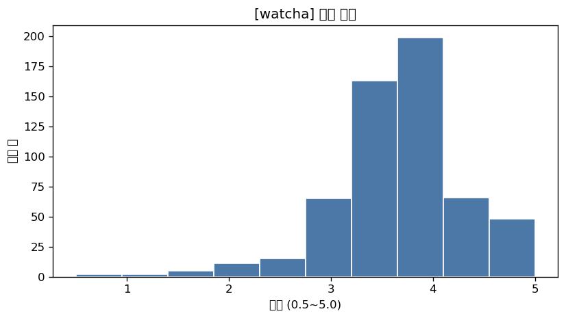 | 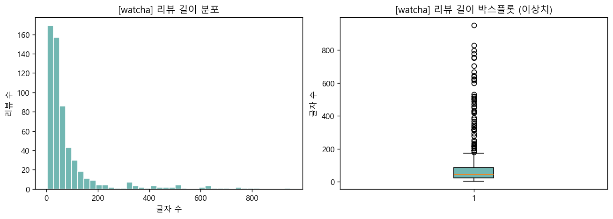 |

| 감성 비율 | 월별 리뷰 수 |
|---|---|
| 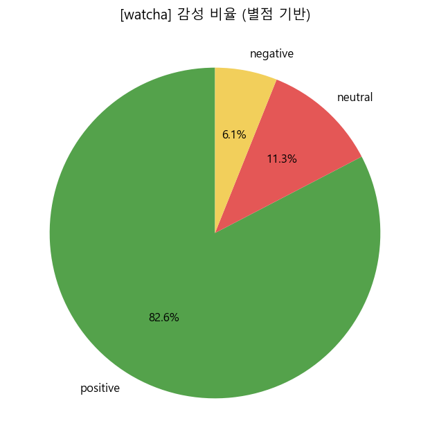 | 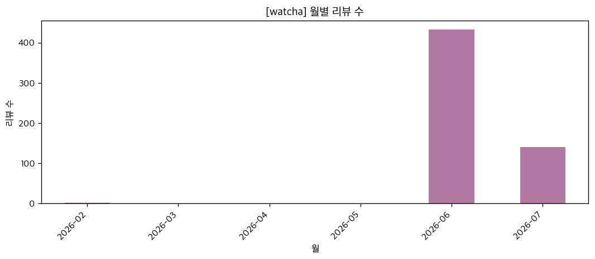 |

- **별점**: 평균 **3.76점**(중앙값 4.0, 표준편차 0.71). 3.5~4.0점에 집중된 좌로 치우친(호평) 분포로,
  왓챠 관객 평이 시리즈 최고점을 경신했다는 세간의 평과 일치합니다. 0.5~1.5점의 저평점은 소수(9건)의 이상치성 값.
- **텍스트 길이**: 평균 88자, 중앙값 42자. 한 줄 감상평이 다수이나 최대 950자의 장문 리뷰도 존재 →
  박스플롯 상 상단 이상치. 3자 미만의 초단문/공백성 리뷰도 존재해 전처리에서 제거.
- **감성(별점 기반)**: 긍정 476 / 중립 65 / 부정 35 → **약 83%가 긍정**.
- **날짜**: 2026-06(개봉월)에 리뷰가 폭증하고 7월까지 이어짐. 개봉 이전(2026-02 등) 소수 리뷰와
  개봉 훨씬 이전(2025년) 관심 코멘트는 기간 이상치로 판단.

### 4-2. IMDb  ✅ [민신원]

전처리 후 500개 리뷰의 분포입니다.

| 별점 분포 | 리뷰 길이 분포 & 이상치 |
|---|---|
| 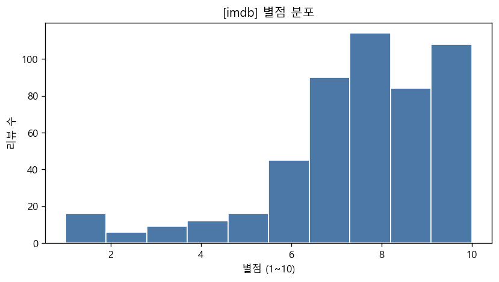 | 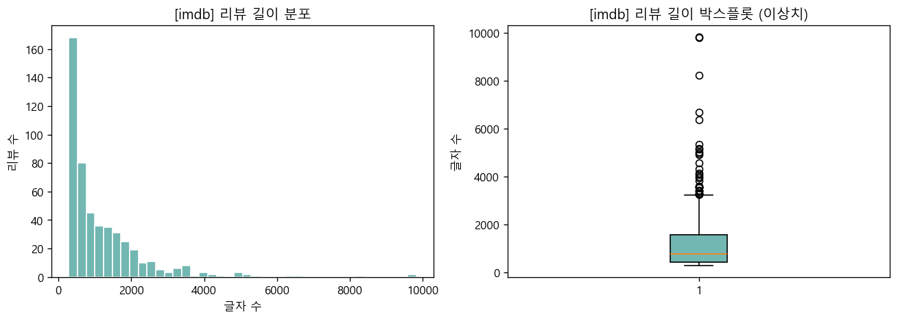 |

| 감성 비율 | 월별 리뷰 수 |
|---|---|
| 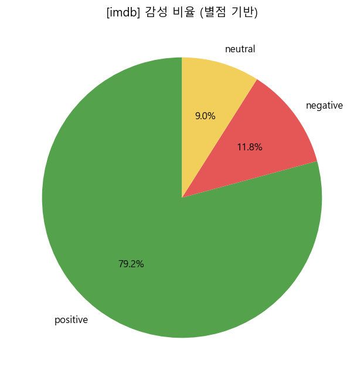 | 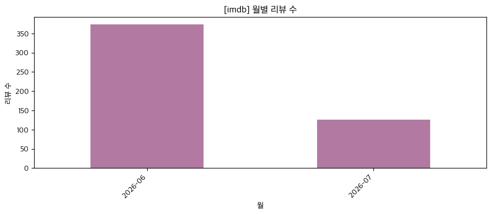 |

- **별점**: 평균 **7.66점**(10점 만점, 중앙값 8.0, 표준편차 **2.14**). 8점이 최빈(114건)이고
  7~10점이 396건으로 79.2%를 차지합니다. 다만 1점도 16건 존재해 **세 사이트 중 산포가 가장 큽니다**.
- **텍스트 길이**: 평균 **1,190자**(중앙값 771자), 단어 기준 평균 217단어. 최대 9,821자의 장문 리뷰가 있으며
  박스플롯 상단이 길게 늘어진 전형적 우편향 분포입니다. 리뷰 제목을 본문과 별도로 다는 에세이형 리뷰 문화입니다.
- **감성(별점 기반)**: 긍정 79.2% / 중립 9.0% / 부정 **11.8%** — 부정 비율이 세 사이트 중 가장 높습니다.
  관람 인증 없이 누구나 평점을 남길 수 있어 호불호가 그대로 드러납니다.
- **날짜**: 2026-06 374건 → 2026-07 126건. 개봉월 집중 후 3분의 1 수준으로 감소하는 패턴이며,
  주말 작성 비율은 37.8%로 요일 편중은 크지 않습니다.

### 4-3. 메가박스  ✅ [윤소현]

전처리 후 542개 리뷰의 분포입니다.

| 별점 분포 | 리뷰 길이 분포 & 이상치 |
|---|---|
| 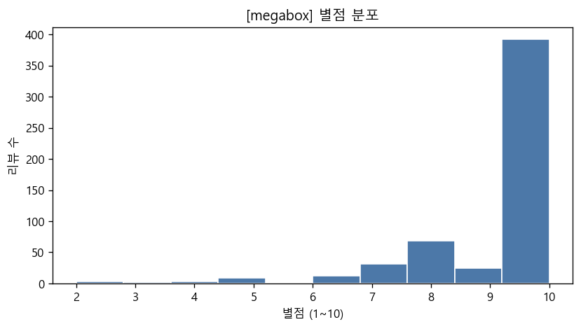 | 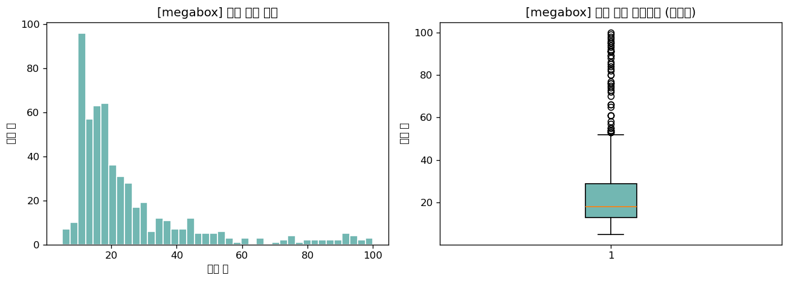 |

| 감성 비율 | 월별 리뷰 수 |
|---|---|
| 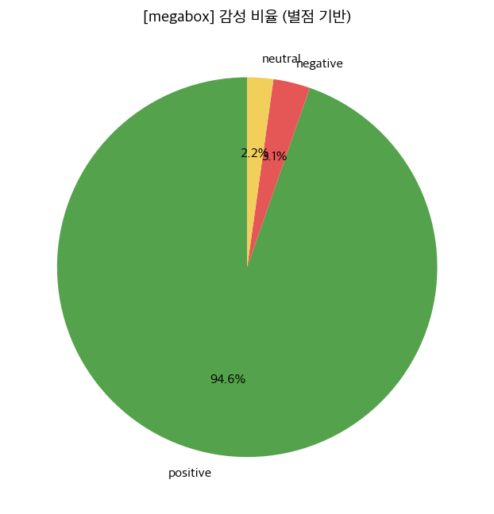 | 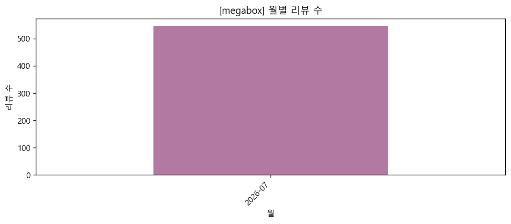 |

- **별점**: 평균 **9.25점**(10점 만점, 중앙값 10.0). **10점이 388건으로 전체의 71.6%** 를 차지하는
  극단적으로 치우친 분포입니다. 5점 이하는 모두 합쳐 17건(3.1%)에 불과합니다.
  예매·관람 이력이 있어야 작성 가능한 **실관람평**이라 자발적으로 표를 산 관객만 남기는 선택 편향이 큽니다.
- **텍스트 길이**: 평균 **25자**(중앙값 18자), 단어 기준 평균 6.1단어. 최댓값이 정확히 100자이고
  95자 이상이 7건뿐이라 사실상 **한 줄 총평** 형식입니다.
- **감성(별점 기반)**: 긍정 **94.6%** / 중립 2.2% / 부정 3.1%. 세 사이트 중 가장 호의적입니다.
- **날짜**: 수집분이 **2026-07-14 ~ 07-20 (7일)** 에 몰려 있습니다. 이는 개봉 후 리뷰가 이 시기에만
  달렸다는 뜻이 아니라, 최신순 페이지에서 550건을 수집하고 멈춘 **수집 구간의 한계**입니다.
  따라서 이 사이트의 월별 추이는 시계열 해석에 사용하지 않았습니다(→ [6-4](#6-4-시계열-비교)).

---

## 5. 전처리 / Feature Engineering

### 5-1. 왓챠피디아  ✅ [최윤서]  (`review_analysis/preprocessing/watcha_processor.py`)

`reviews_watcha.csv`(595행) → `preprocessed_reviews_watcha.csv`(**576행**). 처리 내역:

- **결측치 처리**: 별점·내용·작성일(`rating`/`text`/`created_at`)이 없는 행 제거, 공백-only 텍스트 제거.
- **이상치 처리**
  - 별점: 정상 범위(**0.5~5.0**) 밖 값 제거.
  - 리뷰 길이: 2자 미만(초단문)·1000자 초과(비정상 장문) 제거.
  - 기간: 개봉 이전/미래 등 기간 이상치(2026-01-01 이전, 현재+1일 이후) 제거.
- **텍스트 전처리**: URL 제거, 한글/영문/숫자/기본 문장부호만 남기고 특수문자·이모지 제거, 중복 공백 정리 → `text_clean`.
  간이 한국어 불용어 사전 적용(형태소 분석기는 Java 의존이라 미사용).
- **파생 변수**: `year_month`, `date`, `hour`(시간대), `weekday`(요일), `is_weekend`(주말 여부),
  `review_len`(글자 수), `word_count`(단어 수), `sentiment`(별점 기반 긍정/중립/부정).
- **텍스트 벡터화**: `TfidfVectorizer`(min_df=2, 최대 3000 features) 로 TF-IDF 행렬 생성 후
  `TruncatedSVD` 로 **10차원 임베딩**(`tfidf_svd_0`~`tfidf_svd_9`)으로 축소하여 컬럼으로 저장.

### 5-2. IMDb  ✅ [민신원]  (`review_analysis/preprocessing/imdb_processor.py`)

`reviews_imdb.csv`(500행) → `preprocessed_reviews_imdb.csv`(**500행**). 수집 단계 품질이 좋아 제거된 행이 없습니다.

- **결측치 처리**: `rating`/`date`/`review` 중 하나라도 비어 있으면 제거.
- **중복 제거**: 정제 텍스트를 소문자로 통일(casefold)한 값 기준으로 중복 리뷰 제거.
- **이상치 처리**
  - 별점: 정상 범위(**1~10**) 밖 값과 숫자로 파싱되지 않는 값 제거.
  - 날짜: `%Y-%m-%d` 파싱 실패분과 **최근 10년 범위 밖 / 미래 날짜** 제거.
  - 리뷰 길이: **5단어 미만 / 2000단어 초과** 제거.
- **텍스트 전처리**: HTML 엔티티 복원 후 태그·URL 제거 → 소문자화 → 영문/숫자/어퍼스트로피만 남기고
  나머지 제거 → 중복 공백 정리 → `cleaned_review`.
- **파생 변수**: `rating_normalized`(별점/10, 0.1~1.0), `review_length_chars`, `review_length_words`,
  `review_year`, `review_month`, `review_weekday`(요일명), `is_weekend`.
- **텍스트 벡터화**: 불용어 84개를 제거한 뒤 문서빈도 상위 **50개 단어**의 TF-IDF를
  `tfidf_{단어}` 컬럼로 직접 계산해 저장(외부 라이브러리 없이 구현). 결과 컬럼 수는 총 65개.

### 5-3. 메가박스  ✅ [윤소현]  (`review_analysis/preprocessing/megabox_processor.py`)

`reviews_megabox.csv`(550행) → `preprocessed_reviews_megabox.csv`(**542행**).

- **결측치 처리**: `score`/`review`/`date` 중 하나라도 비어 있거나 파싱할 수 없는 행 제거,
  정제 후 빈 문자열이 된 행 제거.
- **중복 제거**: 특수문자와 공백을 정리한 `cleaned_review` 기준 중복 8건 제거.
- **이상치 처리**
  - 별점: 정상 범위(**1~10**) 밖 값과 숫자로 변환되지 않는 값 제거.
  - 리뷰 길이: 정제 후 **2자 미만 / 1000자 초과** 리뷰 제거.
  - 날짜: 2026-01-01 이전 및 미래 날짜 제거.
- **날짜 정규화**: `2026.07.20` 같은 절대 날짜를 파싱하고, `2 분전`, `3 시간전`,
  `4 일전` 같은 상대 표기는 CSV에서 확인한 크롤링 기준일을 이용해 절대 날짜로 환산.
  결과 데이터의 날짜·날짜 파생변수 결측은 **0건**.
- **텍스트 전처리**: 개행·탭을 공백으로 치환, 한글/영문/숫자를 제외한 특수문자 제거,
  중복 공백 정리 → `cleaned_review`.
- **파생 변수**: `rating`, `created_at`, `review_len`, `word_count`, `year_month`,
  `year`, `month`, `day`, `weekday`, `is_weekend`, `sentiment`.
- **텍스트 벡터화**: `TfidfVectorizer`(min_df=2, 최대 1000 features) 적용 후
  `TruncatedSVD`로 **10차원 임베딩**(`tfidf_svd_0`~`tfidf_svd_9`)을 생성해 저장.

---

## 6. 비교분석 (텍스트 · 시계열)  ✅ [최윤서]

> `review_analysis/visualize.py` 는 `database/preprocessed_reviews_*.csv` 를 **자동으로 모두 병합**해
> 비교 그래프를 그립니다. 새 사이트의 `preprocessed_reviews_{site}.csv` 가 추가되면 아래 그래프에
> 자동으로 함께 그려집니다.

### 6-0. 비교를 위한 정규화

세 사이트는 **별점 척도와 컬럼 스키마가 서로 다릅니다.** 원본 값을 그대로 비교하면
평균이 `왓챠 3.76 / 메가박스 9.25 / IMDb 7.66` 으로 나와 아무 의미가 없으므로,
`visualize.py` 로드 단계에서 아래와 같이 표준화한 뒤 비교했습니다.

| 사이트 | 원 별점 척도 | 별점 컬럼 | 날짜 컬럼 | 길이 컬럼 | 감성 라벨 |
|---|---|---|---|---|---|
| 왓챠피디아 | 0.5 ~ 5.0 | `rating` | `created_at` | `review_len` | 있음 |
| 메가박스 | 1 ~ 10 | `rating` | `created_at`(결측 203) + `date` | `review_len` | 없음 → 파생 |
| IMDb | 1 ~ 10 | `rating` | `date` | `review_length_chars` | 없음 → 파생 |

- **별점**: 모두 **5점 만점으로 환산**(`_rating5 = rating / 만점 × 5`)해 비교.
- **감성**: 라벨이 없는 사이트는 왓챠 전처리와 **동일 기준**(5점 환산 3.5 이상 긍정 / 2.5 이하 부정)으로 파생.
- **날짜**: 메가박스의 `2 분전`, `3 시간전` 같은 상대 표기는 전처리 단계에서
  크롤링 기준일을 이용해 절대 날짜로 환산했습니다. 비교 단계에서도 과거 형식의
  전처리 파일을 읽을 수 있도록 동일한 보정 로직을 예비 처리로 유지했습니다.

### 6-1. 별점 비교

| 사이트별 평균 별점 | 사이트별 별점 분포 | 감성 구성비 |
|---|---|---|
| 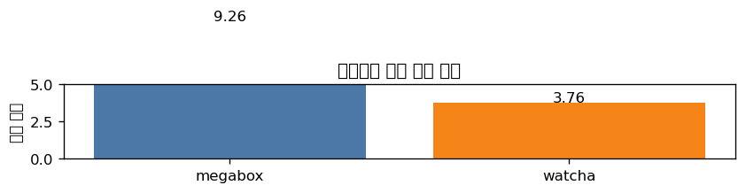 | 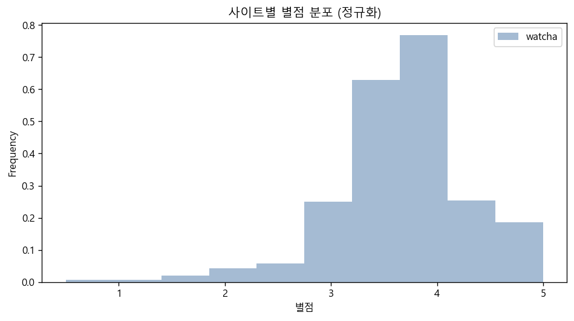 | 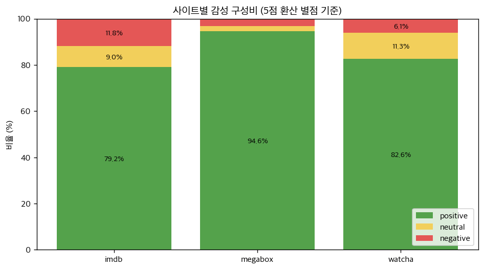 |

| 사이트 | n | 평균(5점) | 중앙값 | 표준편차 | 만점 비율 | 2점 이하 | 긍정 |
|---|---|---|---|---|---|---|---|
| 메가박스 | 542 | **4.63** | 5.0 | 0.71 | **71.6%** | 1.5% | 94.6% |
| IMDb | 500 | 3.83 | 4.0 | **1.07** | 21.6% | **8.6%** | 79.2% |
| 왓챠피디아 | 576 | 3.76 | 4.0 | 0.71 | 8.3% | 3.5% | 82.6% |

- **메가박스가 압도적으로 후합니다.** 평균 4.63에 만점 비율이 71.6%(542건 중 388건이 10점)로,
  분포가 만점 한 점에 몰린 극단적 J자 형태입니다. 메가박스는 **실관람평**(예매·관람 이력이 있어야 작성 가능)
  이라 자기 돈으로 표를 산 관객만 글을 남기는 **선택 편향**이 강하게 작용한 것으로 보입니다.
- **IMDb 는 가장 산포가 큽니다.** 표준편차 1.07로 세 사이트 중 유일하게 1을 넘고, 2점 이하 저평점이 8.6%로
  가장 많습니다. 관람 인증이 없는 익명 평점이라 **호불호가 그대로 드러나는** 구조입니다.
- **왓챠는 평균이 가장 낮지만 2점 이하 비율은 IMDb보다 낮습니다**(3.5% vs 8.6%).
  감성 분류 기준(2.5점 이하)으로 계산한 왓챠의 부정 비율은 **6.1%**입니다. 만점 비율이 8.3%에 불과한 것이
  핵심인데, 0.5점 단위로 평점을 매기는 왓챠 사용자들이 **만점을 아끼고 4.0에 수렴시키는** 성향 때문입니다.
  즉 왓챠의 낮은 평균은 '작품이 별로'라서가 아니라 **평점 문화의 차이**로 해석해야 합니다.
- 정리하면 세 사이트의 평균 차이(4.63 → 3.83 → 3.76)는 작품 평가 차이라기보다
  **플랫폼의 작성 자격(실관람 인증 여부)과 평점 관습의 차이**를 반영합니다.

### 6-2. 텍스트 비교

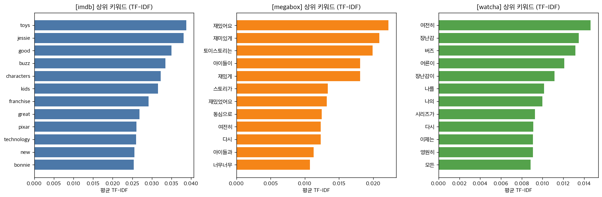

| 사이트 | 상위 TF-IDF 키워드 |
|---|---|
| 왓챠피디아 | `여전히 · 장난감 · 버즈 · 어른이 · 장난감이 · 나를 · 나의 · 시리즈가 · 다시 · 이제는 · 영원히 · 모든` |
| 메가박스 | `재밌어요 · 재미있게 · 토이스토리는 · 아이들이 · 재밌게 · 스토리가 · 재밌었어요 · 동심으로 · 여전히 · 다시 · 아이들과 · 너무너무` |
| IMDb | `toys · jessie · good · buzz · characters · kids · franchise · great · pixar · technology · new · bonnie` |

- **국내 두 사이트는 '감정', IMDb 는 '작품'을 이야기합니다.** IMDb 상위어에는 `jessie · buzz · bonnie`(캐릭터명),
  `franchise · pixar · technology`(프랜차이즈·제작사·기술) 처럼 **작품 외적 분석 어휘**가 올라오는 반면,
  국내 리뷰는 `여전히 · 영원히 · 동심으로` 같은 **정서 어휘**가 상위를 차지합니다.
- **왓챠와 메가박스도 결이 다릅니다.** 왓챠는 `어른이 · 나를 · 나의 · 이제는`처럼 **1인칭 회고**가 두드러져
  시리즈와 함께 자란 관객의 정서가 드러나고, 메가박스는 `아이들이 · 아이들과 · 동심으로`처럼
  **가족 동반 관람 맥락**이 지배적입니다. 같은 영화지만 왓챠는 '나의 추억', 메가박스는 '아이와의 나들이'로 소비됩니다.
- 형태소 분석기를 쓰지 않아 `장난감/장난감이`, `재밌어요/재밌게/재밌었어요` 처럼 조사·어미가 붙은 채로
  분리되는 한계가 있습니다(Java 의존 회피). 어간 통합 시 메가박스의 `재미-` 계열 비중은 더 커집니다.

### 6-3. 리뷰 길이 비교

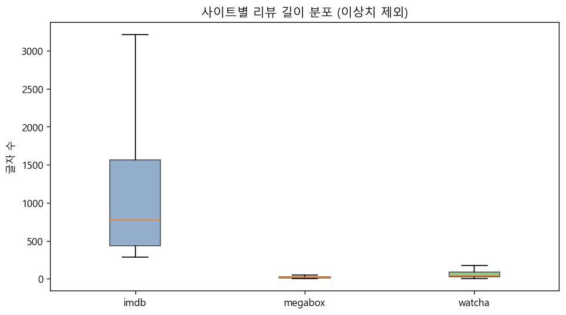

| 사이트 | 평균 | 중앙값 | 75% | 최댓값 |
|---|---|---|---|---|
| IMDb | **1,190자** | 770자 | 1,561자 | 9,821자 |
| 왓챠피디아 | 88자 | 42자 | 86자 | 950자 |
| 메가박스 | 25.3자 | 18자 | 29자 | **100자** |

- **길이가 사이트별로 한 자릿수씩 차이 납니다.** IMDb 중앙값(770자)은 메가박스(18자)의 **40배** 이상입니다.
  IMDb 는 리뷰 제목까지 따로 두는 **에세이형 리뷰 문화**이고, 메가박스는 별점 옆에 한 줄 남기는 형태입니다.
- 메가박스 최댓값이 정확히 **100자**인 것으로 보아 입력 길이 제한이 있는 것으로 보이지만,
  95자 이상 리뷰가 7건뿐이라 **제한에 걸려서 짧은 것은 아닙니다**. 중앙값이 18자인 것은
  실관람평을 '한 줄 총평'으로 소비하는 사용자 관습에 가깝습니다.
- 이 차이 때문에 세 사이트를 하나로 합쳐 텍스트 모델을 학습하면 IMDb 문서가 어휘를 독식합니다.
  후속 분석에서 통합 모델링을 한다면 **사이트별 개별 벡터화 후 비교**하는 편이 안전합니다.

### 6-4. 시계열 비교

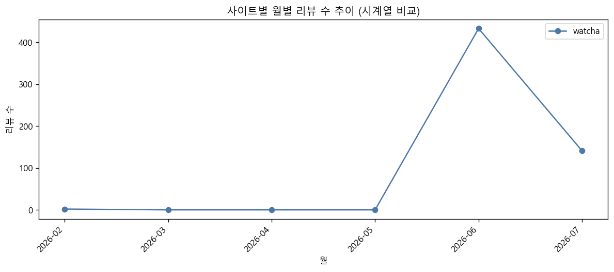

| 월 | IMDb | 메가박스 | 왓챠 |
|---|---|---|---|
| 2026-02 | 미수집 | 미수집 | 2 |
| 2026-06 (개봉월) | 374 | 미수집 | 433 |
| 2026-07 | 126 | 542 | 141 |

- **왓챠·IMDb 는 동일한 개봉 직후 패턴**을 보입니다. 개봉월인 2026-06 에 각각 433건·374건으로 정점을 찍고
  7월에 141건·126건으로 **약 1/3 수준까지 감소**합니다. 국내외 플랫폼을 막론하고 리뷰는 개봉 2~4주에 집중됩니다.
- 왓챠에만 2026-02 에 2건이 있는데, 이는 **개봉 전 기대평**입니다(전처리에서 기간 이상치로 대부분 제거됨).
- ⚠️ **메가박스의 7월 단독 스파이크는 실제 현상이 아니라 수집 구간의 한계입니다.**
  메가박스 데이터의 실제 날짜 범위는 **2026-07-14 ~ 07-20 (7일)** 로, 최신순 페이지에서 수집한
  550건 중 전처리 후 542건을 사용한 결과입니다.
  6월에 리뷰가 없었던 것이 아니라 **수집되지 않은 것**이므로, 시계열 추이 해석은 왓챠·IMDb 두 사이트로만 해야 합니다.
  메가박스까지 추이를 비교하려면 페이지네이션을 개봉월까지 확장해 재수집이 필요합니다.

### 6-5. 종합

- 평균 별점의 사이트 간 격차(4.63 vs 3.8 내외)는 **작품에 대한 평가 차이가 아니라 플랫폼 구조의 차이**입니다.
  실관람 인증이 있는 메가박스는 호평만 남고, 익명 평점인 IMDb 는 부정이 그대로 노출됩니다.
- 세 사이트 모두 **긍정이 79% 이상**이라는 점은 일치합니다. 즉 「토이 스토리 5」에 대한 총평은
  플랫폼과 무관하게 호의적이며, 갈리는 것은 **호평의 강도와 그것을 표현하는 방식**입니다.
- 리뷰 길이와 키워드를 함께 보면 **플랫폼별 사용자층이 뚜렷이 분리**됩니다.
  메가박스 = 아이를 데려간 가족 관객의 짧은 총평 / 왓챠 = 시리즈와 함께 자란 개인의 회고 /
  IMDb = 작품을 분석하려는 장문 리뷰어.

---

## 7. Git 협업 (Branch Protection / PR / Review)  ✅

### 7-1. Branch protection rule

`main` 브랜치에 직접 push 할 수 없도록 보호 규칙을 적용했습니다.
(Require a pull request before merging / Do not allow bypassing the above setting)

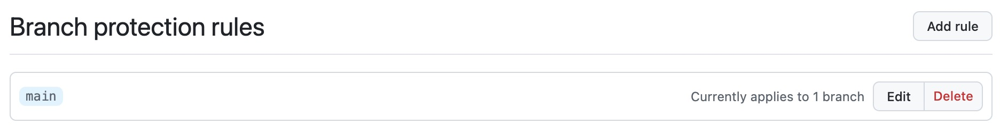

### 7-2. main 직접 push 거부

보호 규칙 적용 후 `main` 에 직접 push 를 시도하면 아래처럼 거부됩니다.

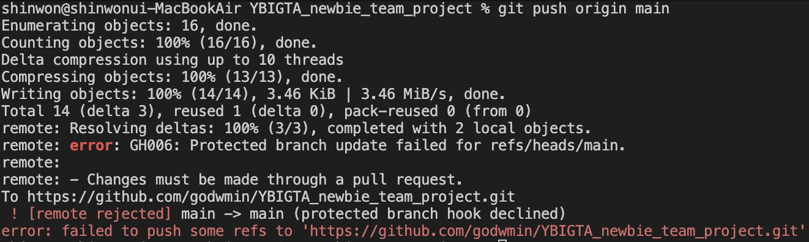

### 7-3. PR 리뷰 후 merge

각자 브랜치에서 작업 → PR 생성 → Reviewer 지정 → 리뷰 코멘트 → merge 순서로 진행했습니다.

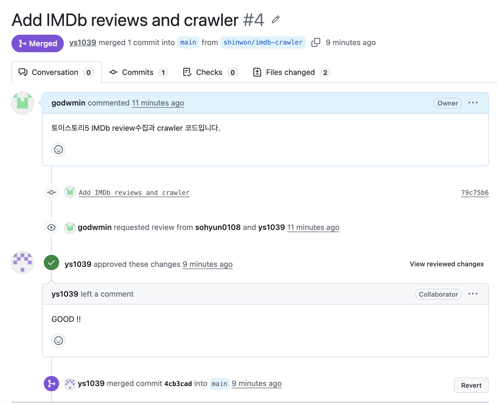

### 7-4. 협업 규칙

- `main` 직접 push 금지. 모든 변경은 **브랜치 → PR → 리뷰 → merge** 를 거칩니다.
- 브랜치 이름은 작업 단위로 구분합니다. (예: `feature/megabox-crawler`, `shinwon/imdb-crawler`,
  `feature/watcha-review-analysis`, `feature/cross-site-comparison`)
- 캐시·산출물은 커밋하지 않습니다. `__pycache__/`, `.mypy_cache/`, `.pytest_cache/`, `*.log`,
  `.DS_Store`, `__MACOSX/` 는 루트 `.gitignore` 에서 제외 처리합니다.

---

## 8. DB 연동 — MySQL 유저 API (8회차)  ✅ [팀원 1]

### 8-1. 구조

기존에 `database/users.json` 파일에 저장하던 유저 정보를 **MySQL** 로 옮겼습니다.
계층은 그대로 유지하고, 저장소(Repository) 구현만 교체했습니다.

```
user_router  →  user_service  →  user_repository  →  MySQL(users)
   (HTTP)        (비즈니스 규칙)      (SQL 실행)         RDS / 로컬
                        ▲
                        └─ dependencies.py 가 요청마다 Session 을 주입
```

| 파일 | 역할 |
|---|---|
| `database/mysql_connection.py` | `.env` 를 읽어 `engine` / `SessionLocal` 생성, `users` 테이블 DDL |
| `app/user/user_repository.py` | `get_user_by_email` / `save_user` / `delete_user` 를 SQL 로 구현 |
| `app/dependencies.py` | `get_db` → `get_user_repository` → `get_user_service` 의존성 체인 |
| `test/test_user_repository.py` | 인메모리 SQLite 로 Repository CRUD 검증 (제공된 파일) |

`users` 테이블 스키마 (앱 기동 시 `init_db()` 가 `CREATE TABLE IF NOT EXISTS` 로 생성):

| 컬럼 | 타입 | 제약 |
|---|---|---|
| `email` | VARCHAR(255) | PRIMARY KEY |
| `password` | VARCHAR(255) | NOT NULL |
| `username` | VARCHAR(255) | NOT NULL |

### 8-2. 실행 방법

```bash
cp .env.example .env      # 값 채우기 (.env 는 커밋 금지)
pip install -r requirements.txt
uvicorn app.main:app --reload --port 8000
```

`.env` 키 (로컬 / RDS 모두 동일):

```
MYSQL_USER=...
MYSQL_PASSWORD=...
MYSQL_HOST=127.0.0.1          # RDS 사용 시 엔드포인트로 교체
MYSQL_PORT=3306
MYSQL_DATABASE=ybigta
MONGO_URL=...                 # 전처리 API용
```

### 8-3. 테스트

```bash
python -m pytest test/test_user_repository.py -v    # 4 passed
python -m pytest test/ -q                           # 21 passed
```

---

<!-- 9장(Docker), 10장(AWS·CI/CD)은 팀원 2·3이 작성합니다. -->

---

## 11. 트러블슈팅 및 개념 정리  ✅ [팀원 1]

### 11-1. pydantic 모델을 ORM 모델로 착각한 문제

**증상.** 처음에는 `User` 를 SQLAlchemy ORM 모델로 바꿔 `session.add(user)` 로 저장하려 했는데,
`user_schema.py` 의 `User` 는 `BaseModel` (pydantic) 이라 `add()` 대상이 되지 못했습니다.
게다가 명세상 수정 가능한 파일은 `user_repository.py` 와 `dependencies.py` 뿐이라
스키마를 ORM 모델로 바꾸는 선택지 자체가 없었습니다.

**해결.** ORM 매핑 없이 **SQLAlchemy Core 의 `text()` 쿼리**로 SQL 을 직접 실행하고,
조회 결과 `Row` 를 `User(...)` 로 변환해 돌려주도록 했습니다.

```python
row = self.db.execute(
    text("SELECT email, password, username FROM users WHERE email = :email"),
    {"email": email},
).fetchone()
return User(email=row.email, password=row.password, username=row.username) if row else None
```

**개념 — pydantic vs SQLAlchemy 모델.** 둘 다 "모델"이라 부르지만 역할이 다릅니다.
pydantic 모델은 *HTTP 경계에서의 검증·직렬화* 담당(요청 JSON → 파이썬 객체, 응답 객체 → JSON)이고,
SQLAlchemy 모델은 *DB 테이블과의 매핑* 담당입니다. 실무에서도 이 둘을 하나로 합치기보다
따로 두고 변환하는 편이 안전합니다. 이번 과제는 Repository 계층이 그 변환 지점 역할을 했습니다.

### 11-2. 생 SQL 을 쓰기로 한 이상 짚고 넘어가야 했던 것 — 파라미터 바인딩

11-1 때문에 `text()` 로 SQL 문자열을 직접 쓰게 되면서, 값을 어떻게 꽂을지가 문제가 됐습니다.
DBAPI 마다 `?`(sqlite3) / `%s`(PyMySQL) 로 스타일이 갈리는데,
SQLAlchemy 는 그 위에서 **`:name` 네임드 바인딩**으로 통일해 줍니다.

```python
text("... WHERE email = :email")   # 값은 {"email": email} 딕셔너리로 전달
```

**개념 — 왜 f-string 으로 SQL 을 만들면 안 되는가.**
`f"... WHERE email = '{email}'"` 처럼 문자열을 이어붙이면 입력값이 SQL 문법으로 해석되어
**SQL Injection** 에 노출됩니다. (`email` 에 `' OR '1'='1` 을 넣으면 전체 행이 조회됩니다.)
바인딩 파라미터를 쓰면 값은 항상 *데이터*로만 전달되고 문법으로 해석되지 않습니다.
덤으로 같은 쿼리 문자열을 재사용하므로 DB 의 실행계획 캐시에도 유리합니다.

### 11-3. UPSERT 문법이 MySQL 과 SQLite 에서 다른 문제

**증상.** `test_update_existing_user` 는 **같은 이메일로 `save_user` 를 두 번 호출하면 갱신**되기를
요구합니다. MySQL 이라면 `INSERT ... ON DUPLICATE KEY UPDATE` 한 줄이면 되지만,
테스트는 **SQLite 인메모리 DB** 에서 돌아가고 SQLite 는 `ON CONFLICT ... DO UPDATE` 를 씁니다.
한쪽 문법으로 쓰면 다른 쪽에서 문법 에러가 납니다.

**해결.** 방언(dialect)에 의존하지 않도록 **조회 후 INSERT / UPDATE 분기**로 구현했습니다.
쿼리 1회가 더 나가지만, 로컬 테스트(SQLite)와 운영(MySQL)에서 동일하게 동작합니다.

**개념 — SQL 방언(dialect).** 표준 SQL 위에 DB 마다 확장 문법이 얹혀 있어서,
`AUTO_INCREMENT`(MySQL) vs `AUTOINCREMENT`(SQLite) vs `SERIAL`(PostgreSQL) 처럼 갈립니다.
SQLAlchemy 가 방언 차이를 흡수해 주지만, 이번처럼 `text()` 로 생 SQL 을 쓰면
그 이점을 포기하는 것이므로 **이식성은 직접 챙겨야** 합니다.

### 11-4. 테스트는 통과하는데 서버에서 데이터가 사라지는 문제 — 트랜잭션과 commit

**증상.** `execute()` 만 하고 `commit()` 을 하지 않으면, 같은 세션 안에서는 조회가 되지만
세션이 닫히는 순간 롤백되어 데이터가 남지 않습니다.

**해결.** `save_user` / `delete_user` 끝에서 `self.db.commit()` 을 호출.

**개념 — 트랜잭션과 세션 수명.**
`SessionLocal(autocommit=False)` 은 첫 쿼리에서 트랜잭션을 열고, `commit()` 전까지의 변경은
그 트랜잭션 안에서만 보입니다. 그래서 `dependencies.get_db()` 를 **제너레이터 의존성**으로 만들어
`yield` 뒤 `finally: db.close()` 로 요청 1건 = 세션 1개 = 트랜잭션 1개 를 보장했습니다.
세션을 전역 하나로 공유하면 요청끼리 트랜잭션이 섞이고, 커넥션 누수로 이어집니다.

```python
def get_db() -> Generator[Session, None, None]:
    db = SessionLocal()
    try:
        yield db          # 라우터 핸들러가 이 세션을 사용
    finally:
        db.close()        # 예외가 나도 반드시 반납
```

### 11-5. `UserRepository()` 가 세션을 못 받던 문제 — 의존성 주입(DI)

**증상.** 기존 `UserRepository` 는 인자 없이 생성되어 JSON 파일을 직접 열었지만,
제공된 테스트는 `UserRepository(db_session)` 처럼 **세션을 주입**합니다.

**해결.** 생성자를 `__init__(self, db: Session)` 로 바꾸고, `dependencies.py` 에
`get_db → get_user_repository → get_user_service` 체인을 만들어 FastAPI 가 주입하도록 했습니다.

**개념 — DI 를 쓰면 무엇이 좋은가.** Repository 가 "세션을 어디서 얻는지" 를 모르게 되므로,
운영에서는 MySQL 세션을, 테스트에서는 SQLite 세션을 그대로 꽂아 넣을 수 있습니다.
실제로 이번 테스트는 **MySQL 없이도** Repository 로직을 검증합니다.
`app.dependency_overrides` 로 라우터 테스트에서 서비스를 통째로 mock 으로 바꾸는 것도 같은 원리입니다.

### 11-6. `.env` 를 커밋할 뻔한 문제

**증상.** 루트 `.gitignore` 에 `.env` 규칙이 없어서, DB 비밀번호가 그대로 올라갈 수 있는 상태였습니다.

**해결.** 루트와 프로젝트 `.gitignore` 에 아래를 추가하고, 대신 값이 비어 있는 `.env.example` 을 커밋했습니다.

```gitignore
.env
.env.*
!.env.example
```

**개념 — 설정과 코드의 분리.** 접속 정보를 코드에 박으면 (1) 환경마다 코드를 고쳐야 하고
(2) 유출 시 되돌릴 수 없습니다. 같은 이유로 CI/CD 에서는 GitHub Secrets, 컨테이너에서는
환경변수 주입을 씁니다. 한 번 커밋된 비밀값은 히스토리에 남으므로 **되돌리기보다 회전(rotate)** 이 원칙입니다.

<!-- TODO(RDS 연결 후 채우기): 아래는 실제로 마주친 에러만 남기고 나머지는 지울 것 -->
### 11-7. RDS 연결 시 마주친 문제

- `(2003, "Can't connect to MySQL server on '...'")` → 보안 그룹 인바운드에 3306 이 없거나 소스 IP 불일치
- `(1045, "Access denied for user ...")` → 계정/비밀번호 불일치
- `(1049, "Unknown database 'ybigta'")` → RDS 생성 시 초기 DB 이름 미지정 → `CREATE DATABASE ybigta;`
- 비밀번호에 `@` `:` `/` 가 들어가면 접속 URL 파싱이 깨짐 → `quote_plus()` 로 인코딩 (코드에 반영함)
- 유휴 커넥션이 끊겨 `MySQL server has gone away` → `create_engine(..., pool_pre_ping=True, pool_recycle=280)`

**개념 — 커넥션 풀.** 요청마다 TCP 연결·인증을 새로 하면 비싸기 때문에 SQLAlchemy 는 커넥션을
풀에 보관해 재사용합니다. 그런데 RDS 는 유휴 커넥션을 일정 시간 뒤 끊으므로, 풀에 남아 있던
"죽은" 커넥션을 그대로 쓰면 위 에러가 납니다. `pool_pre_ping` 은 대여 직전에 가벼운 확인 쿼리를 보내
죽은 커넥션을 걸러내고, `pool_recycle` 은 일정 시간이 지난 커넥션을 선제적으로 폐기합니다.
