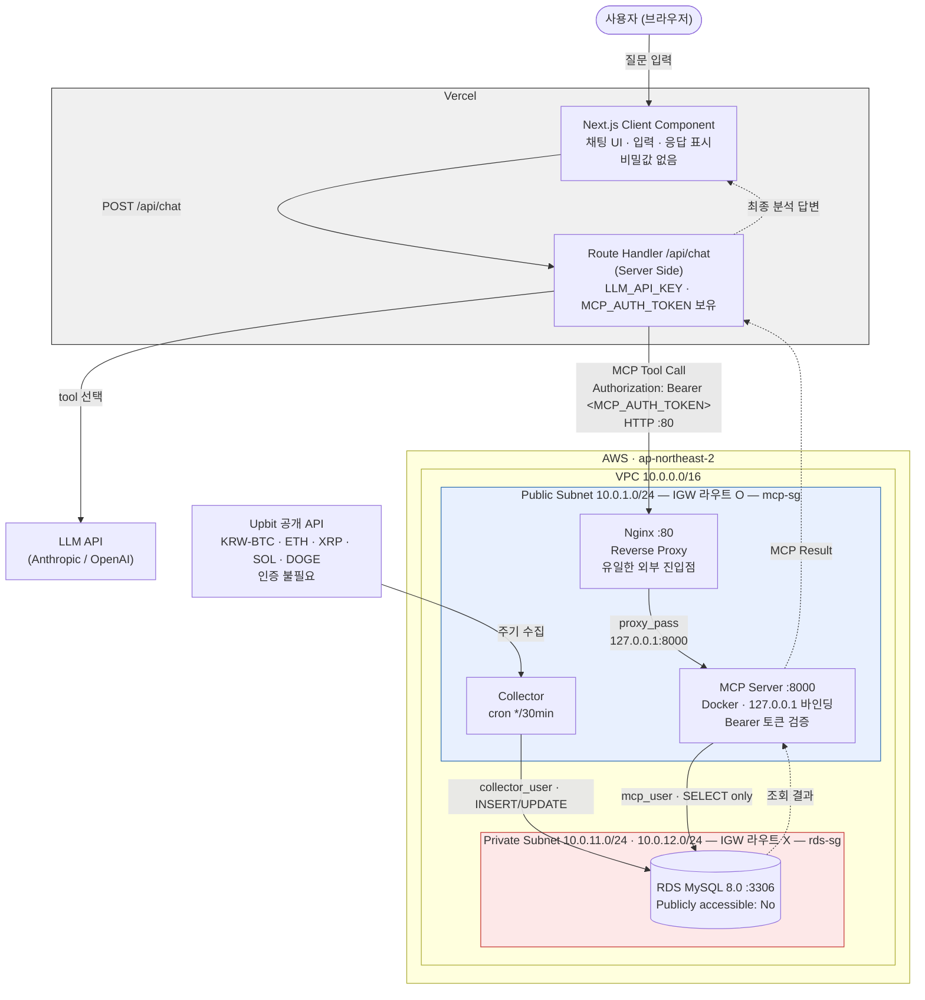

# Architecture & Security (팀원3 담당)

> 이 문서는 최종 `README.md`의 **Architecture** 절과 **Security** 절에 그대로 들어갈 내용이다.
> 팀원1은 MCP Tool 구조, 팀원2는 Data Pipeline / Agent 사용 예시를 각자 이어 붙인다.

---

## 1. Architecture Diagram



<details>
<summary>같은 구조 (ASCII, Mermaid가 렌더링되지 않는 환경용)</summary>

```
        External Data (API / Crawling)
                    │  자동 수집
                    ▼
┌───────────────────────────────────────────────────────┐
│  AWS VPC  10.0.0.0/16          ap-northeast-2         │
│                                                       │
│  Public Subnet 10.0.1.0/24            [mcp-sg]        │
│  ┌─────────────────────────────────────────────────┐  │
│  │  EC2                                            │  │
│  │   Nginx :80  ──proxy──▶  MCP Server :8000       │  │
│  │   (외부 진입점)          (127.0.0.1 바인딩)      │  │
│  │                                                 │  │
│  │   Collector (cron */30)                         │  │
│  └───────────────┬─────────────────┬───────────────┘  │
│      mcp_user    │                 │  collector_user  │
│      SELECT only │  3306           │  INSERT/UPDATE   │
│                  ▼                 ▼                  │
│  Private Subnet 10.0.11.0/24          [rds-sg]        │
│  ┌─────────────────────────────────────────────────┐  │
│  │  RDS MySQL 8.0                                  │  │
│  │  Publicly accessible : No                       │  │
│  │  Inbound 3306 Source : mcp-sg                   │  │
│  │  IGW 라우트 없음                                 │  │
│  └─────────────────────────────────────────────────┘  │
└───────────────────────────────────────────────────────┘
                    ▲
                    │ HTTP :80  Authorization: Bearer <MCP_AUTH_TOKEN>
                    │
        ┌───────────┴────────────┐
        │  Vercel                │
        │   /api/chat (Server)   │  ← LLM_API_KEY, MCP_AUTH_TOKEN
        │        ▲               │
        │        │ POST          │
        │   Client Component     │  ← 비밀값 없음
        └────────┬───────────────┘
                 ▼
              사용자
```
</details>

### 데이터 흐름 한 줄 요약

```
External API  →  Collector(cron)  →  RDS(Private)  →  MCP Server(Public)
              →  Nginx  →  Vercel Route Handler  →  LLM  →  사용자
```

브라우저는 **RDS의 존재 자체를 알지 못한다.** 브라우저가 아는 주소는 자기 자신이 접속한
Vercel 도메인 하나뿐이고, MCP 서버 주소와 인증 토큰은 Vercel 서버 안에만 있다.

---

## 2. VPC 구조

| 구성요소 | 값 | 설명 |
|---|---|---|
| VPC | `10.0.0.0/16` | 과제 전용으로 새로 생성 (기본 VPC 사용 안 함) |
| Public Subnet | `10.0.1.0/24` (2a), `10.0.2.0/24` (2c) | MCP Server EC2 + Collector |
| Private Subnet | `10.0.11.0/24` (2a), `10.0.12.0/24` (2c) | RDS 전용 |
| Internet Gateway | 있음 | Public 라우트 테이블에만 연결 |
| NAT Gateway | **없음** | 아래 설명 참고 |
| Route Table (public) | `0.0.0.0/0 → igw` | 인터넷 양방향 |
| Route Table (private) | `local` 만 | 인터넷 경로 자체가 존재하지 않음 |

**Private Subnet을 2개 만든 이유**: RDS의 DB Subnet Group은 최소 2개 가용영역을 요구한다.
실제 인스턴스는 한 AZ에만 뜨지만(Multi-AZ 비활성), Subnet Group 구성상 두 개가 필요하다.

**NAT Gateway를 두지 않은 이유**: RDS는 인터넷으로 나갈 일이 없고, 인터넷이 필요한
Collector와 MCP Server는 Public Subnet에 있어 IGW로 직접 나간다. NAT Gateway는
시간당 + 데이터 처리량 과금이 발생하므로 이 구조에서는 순수한 낭비다.

---

## 3. Security

### Q1. 왜 DB를 Private Subnet에 두었는가?

DB를 지키는 방법에는 두 층이 있다. 하나는 **비밀번호로 막는 것**이고, 다른 하나는
**애초에 도달할 수 없게 만드는 것**이다. 앞의 것만 쓰면 공격자가 시도할 기회를 무한히 갖는다.
RDS 엔드포인트가 인터넷에서 resolve되는 순간 전 세계의 자동화된 스캐너가 3306 포트에
브루트포스를 시작한다. 실제로 공개된 RDS는 몇 시간 안에 로그인 시도 로그가 쌓인다.

Private Subnet에 두면 **라우팅 테이블에 인터넷으로 나가는 경로 자체가 없다.**
비밀번호가 유출되더라도 VPC 밖에서는 패킷이 도달하지 못한다. 공격자가 DB에 닿으려면
먼저 EC2를 뚫어야 하고, 그러려면 mcp-sg가 열어둔 80번과 22번(내 IP)만 노출된
좁은 표면을 통과해야 한다. 공격 경로를 하나로 강제한 것이다.

부수 효과로 **실수도 막힌다.** 팀원 누군가가 로컬에서 프로덕션 DB에 직접 붙어
테이블을 건드리는 일이 물리적으로 불가능해진다.

### Q2. RDS Security Group은 어떻게 설정했는가?

```
rds-sg  (RDS에 부착)
  Inbound
    Type   : MYSQL/Aurora
    Port   : 3306
    Source : mcp-sg          ← CIDR이 아니라 Security Group ID
  Outbound
    기본값 (Private Subnet이라 인터넷으로 나가지 못함)
```

`0.0.0.0/0 → 3306`은 물론이고, **EC2의 사설 IP를 CIDR로 적는 방식도 쓰지 않았다.**
Source에 Security Group을 지정하면:

- EC2를 재생성해 IP가 바뀌어도 규칙을 고칠 필요가 없다
- Auto Scaling으로 인스턴스가 늘어나도 mcp-sg만 붙이면 자동으로 허용된다
- 반대로 **mcp-sg에 속하지 않은 어떤 리소스도 3306에 도달할 수 없다.** 같은 VPC 안의
  다른 EC2를 누가 새로 띄워도 DB에 붙지 못한다

즉 "특정 IP"가 아니라 **"이 역할을 부여받은 리소스"** 를 기준으로 허용한다.

검증: `infra/scripts/verify_security.sh` 의 3번 항목이 `0.0.0.0/0` 인바운드 부재와
Source가 SG인지를 자동으로 확인한다.

### Q3. MCP의 내부 API Port를 어떻게 보호했는가?

MCP 서버는 Public Subnet에 있지만 **8000번 포트는 인터넷에서 접근할 수 없다.**
세 겹으로 막았다.

| 계층 | 조치 | 뚫렸을 때의 결과 |
|---|---|---|
| ① Security Group | mcp-sg 인바운드에 8000이 아예 없음 (80/443/22만) | 패킷이 EC2에 도달조차 못 함 |
| ② Docker 바인딩 | `-p 127.0.0.1:8000:8000` 으로 루프백에만 바인딩 | SG가 잘못 열려도 NIC에 리스닝하지 않음 |
| ③ Nginx | `proxy_pass http://127.0.0.1:8000` — 80번만 외부 노출 | 모든 요청이 프록시를 거침 |

②는 특히 중요하다. Docker는 `-p 8000:8000`으로 띄우면 iptables에 DNAT 규칙을 직접
삽입하기 때문에, **Security Group이나 ufw 설정과 무관하게 포트가 뚫리는 사고**가 흔하다.
바인딩 주소를 `127.0.0.1`로 명시해 이 경로를 원천 차단했다.

Nginx는 리버스 프록시 역할에 더해 요청 바디 크기 제한(`client_max_body_size 1m`),
IP당 rate limit(`20r/s`), 서버 버전 숨김(`server_tokens off`)을 적용한다.
설정 파일: `infra/ec2/nginx/mcp.conf`

검증: 로컬에서 `curl http://<EC2_IP>:8000` → 타임아웃, `curl http://<EC2_IP>/health` → 200.
`verify_security.sh` 5번 항목이 이 둘을 자동으로 확인한다.

### Q4. MCP 인증은 어떻게 구현했는가?

모든 MCP 요청에 `Authorization: Bearer <MCP_AUTH_TOKEN>` 헤더를 요구한다.

- 토큰 검증은 **MCP 애플리케이션(FastAPI 미들웨어)에서** 수행한다. Nginx는 헤더를
  그대로 전달만 한다. 인증 판단을 프록시에 두면 프록시를 우회하는 경로가 생겼을 때
  같이 무너지기 때문이다.
- 비교는 `hmac.compare_digest`로 수행해 타이밍 공격을 피한다.
- 토큰은 코드에 없다. EC2의 `/opt/mcp/.env`(권한 600, git 추적 안 됨)에 있고
  systemd가 `--env-file`로 컨테이너에 주입한다. Vercel 쪽 사본은 Vercel의
  Environment Variables에 Server-side 전용으로 저장한다.
- 토큰 생성: `openssl rand -hex 32`

**CORS는 인증이 아니다.** CORS는 브라우저가 스스로 지키는 규칙일 뿐이라 `curl`이나
서버 간 호출에는 아무 효력이 없다. 그래서 CORS 설정과 별개로 서버 측 토큰 검증을 두었다.

> 구현 위치는 팀원1의 `mcp_server/` 안. 인프라 쪽에서는 토큰이 환경변수 경로로만
> 흐르도록 배선하고, 인증 없는 호출이 401로 떨어지는지를 `verify_security.sh`로 검증한다.

### Q5. 왜 Vercel Client에서 MCP를 직접 호출하지 않았는가?

브라우저에 내려간 코드는 전부 사용자가 읽을 수 있다. 개발자 도구의 Network 탭이나
번들 파일 하나만 열어도 그 안의 문자열이 다 보인다. Client Component에서 MCP를
호출하려면 `MCP_AUTH_TOKEN`을 브라우저로 내려보내야 하는데, 그 순간 **토큰은
공개된 것과 같다.** 누구나 그 토큰으로 우리 MCP 서버를 직접 때릴 수 있다.

그래서 호출 사슬을 이렇게 끊었다.

```
Browser  ──POST /api/chat──▶  Vercel Route Handler  ──Bearer 토큰──▶  MCP Server
(비밀값 0)                    (비밀값 보관)
```

브라우저가 보내는 것은 사용자의 질문 텍스트뿐이다. LLM 호출, tool 선택, MCP 호출,
결과 정리는 전부 서버에서 일어나고 브라우저는 최종 답변만 받는다.
`NEXT_PUBLIC_` 접두사는 Client Bundle에 값을 심어버리므로 비밀값에 절대 쓰지 않는다.

부가적으로, MCP 서버 입장에서 허용해야 할 출발지가 "전 세계 브라우저"에서
"Vercel 서버"로 좁혀진다.

### Q6. API Key와 Token은 어디에서 관리하는가?

| 비밀값 | 보관 위치 | 접근 주체 |
|---|---|---|
| `MCP_AUTH_TOKEN` | EC2 `/opt/mcp/.env` + Vercel 환경변수 | MCP 서버, Vercel 서버 |
| `DB_PASSWORD` (mcp_user) | EC2 `/opt/mcp/.env` | MCP 서버만 |
| `COLLECTOR_DB_PASSWORD` (collector_user) | EC2 `/opt/mcp/collector.env` | Collector만 |
| `ANTHROPIC_API_KEY` | Vercel 환경변수 (Server) | Vercel Route Handler만 |
| RDS 마스터 비밀번호 | 어디에도 배포 안 함. 최초 계정 생성 시에만 사용 | 사람 |

원칙 세 가지:

1. **저장소에는 `.env.example`만.** `.gitignore`와 `.dockerignore` 양쪽에 `.env`, `*.pem`을
   넣어 커밋과 이미지 빌드 모두에서 제외한다.
2. **필요한 곳에만 준다.** MCP 서버는 `collector_user` 자격증명을 아예 갖고 있지 않고,
   Collector는 `MCP_AUTH_TOKEN`을 모른다. 하나가 털려도 전부가 털리지 않는다.
3. **비밀값은 이미지가 아니라 런타임에 주입한다.** Docker 이미지 안에 credential이
   들어가면 이미지를 받는 누구나 볼 수 있다. `--env-file`로 실행 시점에만 넣는다.

---

## 4. DB 계정 분리

```
admin           스키마 변경 / 계정 관리 전용. 애플리케이션은 사용하지 않음
  │
  ├── collector_user   SELECT, INSERT, UPDATE     ← 수집 프로그램
  │                    (DELETE / DROP / ALTER 없음)
  │
  └── mcp_user         SELECT                     ← MCP Server
                       (쓰기 권한 전무)
```

MCP가 Agent에게 제공하는 것은 조회 기능뿐이므로, MCP가 쓰는 계정에는 쓰기 권한을
줄 이유가 없다. 애플리케이션 레벨에서 이미 Raw SQL Tool을 만들지 않고 입력을
검증하지만, **코드 실수나 LLM의 예상 못 한 입력이 있더라도 DB 권한 자체가 없으면
쓰기가 발생할 수 없다.** 방어를 코드가 아니라 권한 모델에 박아 넣은 것이다.

`collector_user`에서 `DELETE`와 DDL을 뺀 것도 같은 이유다. 수집 코드의 버그로
테이블이 통째로 비워지는 사고 경로를 없앴다.

- 계정 생성: `infra/sql/01_db_users.sql`
- read-only 검증: `infra/sql/02_verify_readonly.sql`
  (mcp_user로 INSERT를 시도해 `ERROR 1142` 가 뜨는 것을 증빙으로 남긴다)

---

## 5. 자동 수집 스케줄러

| 항목 | 값 |
|---|---|
| 실행 위치 | Public Subnet의 EC2 (MCP Server와 같은 인스턴스, 다른 컨테이너) |
| 스케줄러 | `cron` — `*/30 * * * *` (30분 간격) |
| 실행 래퍼 | `/opt/mcp/run_collector.sh` |
| 로그 | `/var/log/ybigta/collector.log` (logrotate 7일) |
| DB 계정 | `collector_user` (INSERT/UPDATE) |

래퍼 스크립트에 `flock`을 걸어 **이전 수집이 안 끝났으면 다음 주기를 건너뛴다.**
겹쳐 실행되면 중복 INSERT가 생기기 때문이다. 시작·종료 시각과 종료 코드를 로그에
남겨 "실제로 자동 갱신되고 있음"을 `collected_at` 컬럼과 함께 증명한다.

설정 파일: `infra/scheduler/crontab.example`
systemd timer 대안(재부팅 중 놓친 실행을 따라잡음): `infra/scheduler/collector.timer`

---

## 6. IaC (Terraform)

VPC · Subnet · Route Table · Security Group · RDS · EC2를 전부 코드로 관리한다.

```bash
cd infra/terraform
cp terraform.tfvars.example terraform.tfvars   # 값 채우기
terraform init
terraform plan
terraform apply
```

콘솔 클릭으로 만든 인프라는 무엇이 왜 그렇게 설정됐는지 나중에 알 수 없고, 재현도
불가능하다. 코드로 두면 리뷰가 가능하고 `terraform destroy` 한 줄로 과금도 정리된다.
`my_ip_cidr` 변수에는 `0.0.0.0/0`을 넣으면 `validation`이 apply를 거부하도록 해두었다.

과제 종료 후: `terraform destroy` 또는 `infra/scripts/cleanup_check.sh`로 잔여 리소스 점검.
