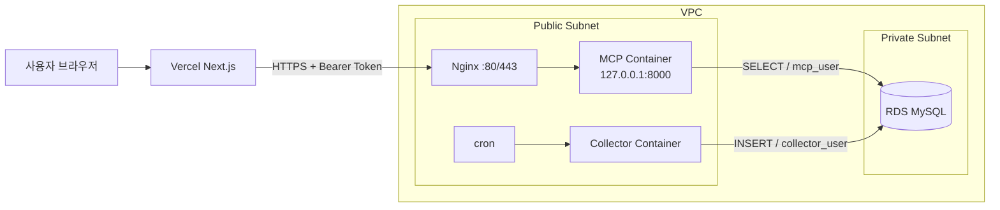

# AWS 배포 및 보안 설계

## 네트워크 구조

## AWS 콘솔 체크리스트

1. 서로 다른 AZ에 Public Subnet과 Private Subnet을 만들고, EC2는 Public Subnet, RDS DB Subnet Group은 Private Subnet만 사용합니다.
2. RDS의 `Public access`를 `No`로 설정합니다.
3. `mcp-sg`의 inbound는 인터넷에서 80/443만 허용하고, SSH가 필요하면 팀원의 고정 IP만 22번에 허용합니다. 8000번은 열지 않습니다.
4. `rds-sg` inbound의 MySQL 3306 source는 IP가 아니라 `mcp-sg`만 지정합니다.
5. EC2의 Docker MCP 포트는 `127.0.0.1:8000:8000`으로 bind하고 외부 요청은 Nginx만 통과시킵니다.
6. 운영 DB 계정은 `mcp_server/database/grants.sql`의 placeholder를 강한 비밀번호로 바꿔 RDS 관리자 계정으로 한 번만 생성합니다.

## EC2 최초 준비

Docker, Nginx, `flock`을 설치하고 EC2 사용자에게 Docker 실행 권한을 부여합니다. 배포 workflow는 다음 파일을 `$HOME/ybigta`에 배치합니다.

- `.env`: MCP 서버 전용 DB 계정과 Bearer Token
- `collector.env`: Collector 전용 INSERT 계정
- `collector-image`: 스케줄러가 실행할 immutable image tag
- `run-collector.sh`: 1회 수집 실행 파일

`infra/nginx/mcp.conf`는 `/etc/nginx/conf.d/mcp.conf`에 설치됩니다. 실제 운영에서는 도메인과 인증서를 연결해 80을 443으로 redirect하고, Vercel의 `MCP_SERVER_URL`에는 `https://<domain>/mcp`를 등록합니다.

## GitHub Actions Secrets

`DOCKERHUB_USERNAME`, `DOCKERHUB_TOKEN`, `DOCKERHUB_REPOSITORY`, `EC2_HOST`, `EC2_USERNAME`, `EC2_SSH_KEY`, `EC2_KNOWN_HOSTS`, `DB_HOST`, `DB_PORT`, `DB_NAME`, `MCP_DB_USER`, `MCP_DB_PASSWORD`, `COLLECTOR_DB_USER`, `COLLECTOR_DB_PASSWORD`, `MCP_AUTH_TOKEN`이 필요합니다. `EC2_KNOWN_HOSTS`에는 신뢰할 수 있는 경로에서 확인한 EC2 SSH host key 한 줄을 넣어 배포 중 MITM을 막습니다.

## 제출 캡처

- `rds_private.png`: RDS Public access가 No이고 DB Subnet Group이 Private Subnet인 화면
- `security_group.png`: rds-sg 3306 source가 mcp-sg인 화면
- 추가 권장: EC2 Security Group에 8000 inbound가 없고 컨테이너가 `127.0.0.1:8000`으로 bind된 화면
